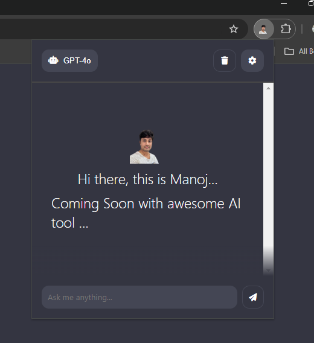

# Chrome Extension for finance AI Agent by Manojkke

That sounds like an exciting development! Integrating an AI Agent for finance could significantly enhance the investment decision-making process. 

By processing vast amounts of financial data and offering tailored insights, this could make finding better investment opportunities more efficient. 

If you need any assistance in refining or expanding this AI Agent, feel free to ask! I'd be happy to help you with any technical or strategic advice.

[LinkedIn : ](https://www.linkedin.com/in/manoj-kumar-kandasamy-05659a46/)

## ✨ Features we are planning to build 

  - 💬 Personalized Investment Recommendations
Tailored suggestions based on user preferences, risk tolerance, and financial goals.

 - 🌄 Real-Time Market Analysis
Integration with real-time financial data to provide up-to-date market trends, news, and stock performance.

 - 🎛️ Risk Assessment Tools
Use AI to assess risk levels for various investments and create balanced portfolios.

  - 💾 Predictive Analytics
Forecast potential investment returns based on historical data and market patterns.

 - 🛟  Investment Tracking
Monitor portfolio performance, track gains/losses, and provide actionable insights for adjustments.
 
 - 🌄  Smart Portfolio Rebalancing
Automatically adjust portfolios based on market conditions or when user-defined criteria are met.

 - 💬Financial Goal Planning
Set and track goals (e.g., retirement, buying a home) with AI-driven projections on how to reach them.

 - ✨ Automated Reporting
Generate detailed, understandable reports on portfolio performance, risk, and recommendations.

## 📸 Screenshots

    

 
## 🚀 Getting started
    
1. Clone the extension or download the latest release.
2. Open the Chrome browser and navigate to [chrome://extensions](chrome://extensions).
3. Enable the developer mode by clicking the toggle switch in the top right corner of the page.
4. Click on the "Load unpacked" button and select the cloned extension folder.
5. The options page automatically opens where you need to enter your OpenAI API-Key.
    
The extension should now be installed and ready to use. Open the extension by clicking on the chrome-themed OpenAI icon in the top right corner of your browser.

## 🚨 Note

For the extension to work, you need to have an OpenAI API-Key. You can get one by signing up on the [OpenAI website](https://openai.com/). Once you have an API-Key, you will need to enter it in the options page of the extension.
